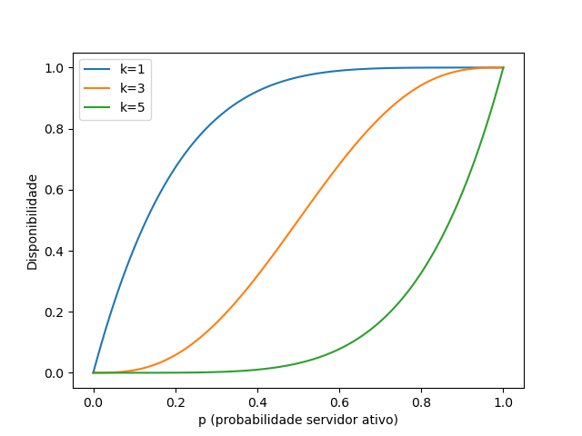

# Exercícios 1.1 e 1.2 — Computação Distribuída

## Alunos

Nome: Cainã Rocha  
Matrícula: 2315038  

Nome: Davi Silveira  
Matrícula: 2310347 

Nome: Marcos André  
Matrícula: 2310371 

Nome: Pedro Vieira  
Matrícula: 2315708 

Universidade de Fortaleza — UNIFOR

---

# Exercício 1.1

## Conceito de Disponibilidade

Disponibilidade é a proporção do tempo em que um sistema permanece em funcionamento:

Disponibilidade = tempo em operação / (tempo em operação + tempo fora de operação)

Em sistemas distribuídos, a disponibilidade pode ser aumentada através da **redundância**, utilizando múltiplos servidores para o mesmo serviço. Assim, mesmo que alguns falhem, o sistema continua operando.

---

## Modelagem do Problema

Considere:

* n = número total de servidores
* k = número mínimo de servidores necessários
* p = probabilidade de um servidor estar disponível

Assume-se independência entre os servidores.

---

## Derivação da Fórmula

Cada servidor possui:

* probabilidade p de estar disponível
* probabilidade (1 − p) de falhar
Queremos calcular a disponibilidade de um serviço replicado em múltiplos servidores.
O sistema funciona se pelo menos k servidores estiverem disponíveis.

A disponibilidade é dada por:

$$A(n,k,p) = \sum_{i=k}^{n} \binom{n}{i} p^i (1-p)^{n-i}$$

### Definição dos Parâmetros:

* [cite_start]**$n$**: Número de servidores.
* **$k$**: Mínimo de servidores ativos.
* **$p$**: Probabilidade de um servidor estar disponível.
* **$i$**: Variável de iteração representando o número de servidores ativos em cada cenário.
* **$\binom{n}{i}$**: Coeficiente binomial ($\frac{n!}{i!(n-i)!}$), que representa as combinações possíveis de servidores ativos.

A probabilidade de exatamente i servidores estarem disponíveis segue a distribuição binomial:

P(i) = C(n,i) · p^i · (1-p)^(n-i)

O sistema funciona se pelo menos k servidores estiverem ativos:

A(n,k,p) = Σ(i=k até n) C(n,i) · p^i · (1-p)^(n-i)

---

## Casos Extremos

### Consulta (k = 1)

A(n,1,p) = 1 - (1 - p)^n

### Atualização (k = n)

A(n,n,p) = p^n

---

## Interpretação
* $k = 1$

* $A = 1 - (1-p)^n$

* $k = n$

* $A = p^n$

* Quanto menor k, maior a disponibilidade
* Quanto maior k, menor a disponibilidade
* Existe um trade-off entre disponibilidade e consistência
---

## Exercício 1.2

Foram utilizados dois métodos:

1. Cálculo analítico utilizando a fórmula binomial
2. Simulação estocástica com números aleatórios

Na simulação:

- cada servidor gera um número $n$, onde $n \in (0, 1)$
- se $n \leq p$ → servidor disponível
- contamos quantos servidores estão ativos
- se pelo menos $k$ estiverem ativos → serviço disponível

A frequência experimental converge para o valor teórico da fórmula.

---

## Visualização

O script [analysis.py](analysis.py) gera um gráfico da disponibilidade em função de p para diferentes valores de k.
Os gráficos mostram a relação entre a probabilidade p de um servidor estar disponível e a disponibilidade total do sistema para diferentes valores de k.

Gráfico gerado por [analysis.py](analysis.py):
